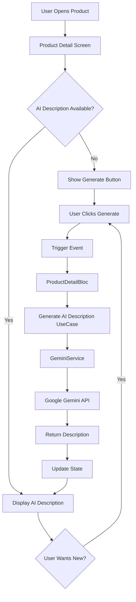

# 🤖 AI-Powered Product Description Implementation Guide

A comprehensive guide to implement and integrate AI-powered product descriptions in your existing e-commerce application using Google's Gemini AI.

---

## 📋 Table of Contents

1. [Overview](#overview)
2. [Prerequisites](#prerequisites)
3. [Architecture](#architecture)
4. [Setup Instructions](#setup-instructions)
5. [Implementation Details](#implementation-details)
6. [Usage Guide](#usage-guide)
7. [Customization](#customization)
8. [Troubleshooting](#troubleshooting)
9. [Best Practices](#best-practices)

---

## 🎯 Overview

This implementation adds **AI-powered product descriptions** to your e-commerce application, providing:

- ✨ **Personalized Descriptions**: Based on user purchase history
- 🎨 **Enhanced Content**: Highlighting product features, ratings, and variants
- 🤖 **Smart Recommendations**: AI-driven "Why buy" and "Consider before buying" sections
- 🔄 **Real-time Generation**: On-demand description generation with streaming support
- 📊 **Rating Analysis**: Intelligent content based on product ratings

---

## ✅ Prerequisites

### Required Dependencies

Add these to your `pubspec.yaml`:

```yaml
dependencies:
  google_generative_ai: ^0.4.0  # Google Gemini AI SDK
  flutter_dotenv: ^5.1.0        # Environment variable management
  flutter_bloc: ^8.1.3          # State management
  shimmer: ^3.0.0               # Loading animations
```

### API Key Setup

1. **Get a Gemini API Key**:
   - Visit [Google AI Studio](https://makersuite.google.com/app/apikey)
   - Create a new API key
   - Copy the key for use in environment configuration

2. **Configure Environment Variables**:

Create/update your `.env` file in the project root:

```env
# Development Environment
GEMINI_API_KEY_DEV=your_development_api_key_here

# Staging Environment
GEMINI_API_KEY_STAGE=your_staging_api_key_here

# Production Environment
GEMINI_API_KEY_PROD=your_production_api_key_here
```

> ⚠️ **IMPORTANT**: Never commit the `.env` file to version control. Ensure it's listed in `.gitignore`.

---

## 🏗️ Architecture

### Directory Structure

```
lib/
├── services/
│   └── ai/
│       ├── gemini_service.dart       # Core AI service implementation
│       └── gemini_constants.dart     # Configuration & prompts
│
└── presentation/
    └── product_detail/
        ├── bloc/
        │   ├── product_detail_bloc.dart       # Business logic
        │   ├── product_detail_event.dart      # Events
        │   └── product_detail_state.dart      # States
        ├── domain/
        │   ├── entities/
        │   │   └── ai_product_description.dart  # Data model
        │   ├── repositories/
        │   │   └── product_detail_repository.dart
        │   └── usecases/
        │       └── generate_ai_product_description.dart  # Use case
        ├── widgets/
        │   └── ai_product_description.dart    # UI widget
        └── product_detail_screen.dart         # Main screen
```

### Flow Diagram



---

## 🚀 Setup Instructions

### Step 1: Initialize Gemini Service

In your app's initialization file (usually `main.dart`):

```dart
import 'package:flutter_dotenv/flutter_dotenv.dart';
import 'package:skelter/services/ai/gemini_service.dart';

Future<void> main() async {
  WidgetsFlutterBinding.ensureInitialized();
  
  // Load environment variables
  await dotenv.load(fileName: ".env");
  
  // Initialize Gemini Service
  try {
    GeminiService().initialize();
    debugPrint('[App] Gemini Service initialized successfully');
  } catch (e) {
    debugPrint('[App] Failed to initialize Gemini Service: $e');
    // Handle initialization failure (optional: disable AI features)
  }
  
  runApp(MyApp());
}
```

### Step 2: Register Dependencies

Add Gemini service to your dependency injection container:

```dart
// In your injection_container.dart or wherever you setup dependencies

import 'package:skelter/services/ai/gemini_service.dart';
import 'package:skelter/presentation/product_detail/domain/usecases/generate_ai_product_description.dart';

final sl = GetIt.instance;

Future<void> init() async {
  // Register Gemini Service as Singleton
  sl.registerLazySingleton<GeminiService>(() => GeminiService());
  
  // Register UseCase
  sl.registerLazySingleton<GenerateAiProductDescription>(
    () => GenerateAiProductDescription(geminiService: sl()),
  );
}
```

### Step 3: Create Data Models

#### AI Product Description Entity

Create `lib/presentation/product_detail/domain/entities/ai_product_description.dart`:

```dart
class AiProductDescription {
  final String productId;
  final String generatedDescription;
  final DateTime generatedAt;
  final bool isPersonalized;

  const AiProductDescription({
    required this.productId,
    required this.generatedDescription,
    required this.generatedAt,
    this.isPersonalized = false,
  });

  AiProductDescription copyWith({
    String? productId,
    String? generatedDescription,
    DateTime? generatedAt,
    bool? isPersonalized,
  }) {
    return AiProductDescription(
      productId: productId ?? this.productId,
      generatedDescription: generatedDescription ?? this.generatedDescription,
      generatedAt: generatedAt ?? this.generatedAt,
      isPersonalized: isPersonalized ?? this.isPersonalized,
    );
  }
}
```

### Step 4: Implement UseCase

Create `lib/presentation/product_detail/domain/usecases/generate_ai_product_description.dart`:

```dart
import 'package:skelter/services/ai/gemini_service.dart';
import 'package:skelter/services/ai/gemini_constants.dart';
import 'package:skelter/presentation/product_detail/domain/entities/product_detail.dart';
import 'package:skelter/presentation/product_detail/domain/entities/ai_product_description.dart';

class GenerateAiProductDescription {
  final GeminiService geminiService;

  GenerateAiProductDescription({required this.geminiService});

  Future<AiProductDescription> call({
    required ProductDetail product,
    List<String>? userOrderHistory,
  }) async {
    // Build the prompt
    final prompt = _buildPrompt(product, userOrderHistory);
    
    // Generate description using Gemini
    final description = await geminiService.generateContent(
      prompt: prompt,
    );
    
    return AiProductDescription(
      productId: product.id,
      generatedDescription: description,
      generatedAt: DateTime.now(),
      isPersonalized: userOrderHistory != null && userOrderHistory.isNotEmpty,
    );
  }

  String _buildPrompt(ProductDetail product, List<String>? orderHistory) {
    final buffer = StringBuffer();
    
    // System instruction
    buffer.writeln(GeminiConstants.productDescriptionSystemInstruction);
    buffer.writeln('\n---\n');
    
    // Product details
    buffer.writeln('PRODUCT INFORMATION:');
    buffer.writeln('Title: ${product.title}');
    buffer.writeln('Category: ${product.category}');
    buffer.writeln('Price: \$${product.price}');
    buffer.writeln('Rating: ${product.rating}/5.0');
    
    if (product.description.isNotEmpty) {
      buffer.writeln('Original Description: ${product.description}');
    }
    
    // User personalization
    if (orderHistory != null && orderHistory.isNotEmpty) {
      buffer.writeln('\nUSER PURCHASE HISTORY:');
      buffer.writeln('Previous categories purchased: ${orderHistory.join(", ")}');
    }
    
    buffer.writeln('\n---\n');
    buffer.writeln('Generate a compelling product description following the guidelines above.');
    
    return buffer.toString();
  }
}
```

### Step 5: Update Bloc Events

Add to `lib/presentation/product_detail/bloc/product_detail_event.dart`:

```dart
abstract class ProductDetailEvent extends Equatable {
  const ProductDetailEvent();

  @override
  List<Object?> get props => [];
}

// ... existing events

class GenerateAiDescriptionEvent extends ProductDetailEvent {
  final ProductDetail productDetail;
  final List<String>? userOrderHistory;

  const GenerateAiDescriptionEvent({
    required this.productDetail,
    this.userOrderHistory,
  });

  @override
  List<Object?> get props => [productDetail, userOrderHistory];
}
```

### Step 6: Update Bloc States

Add to `lib/presentation/product_detail/bloc/product_detail_state.dart`:

```dart
abstract class ProductDetailState extends Equatable {
  final ProductDetail? productDetail;
  final AiProductDescription? aiDescription;
  final bool isGeneratingAiDescription;
  final String? errorMessage;

  const ProductDetailState({
    this.productDetail,
    this.aiDescription,
    this.isGeneratingAiDescription = false,
    this.errorMessage,
  });

  @override
  List<Object?> get props => [
        productDetail,
        aiDescription,
        isGeneratingAiDescription,
        errorMessage,
      ];
}

// ... existing states

class AiDescriptionLoading extends ProductDetailState {
  const AiDescriptionLoading({
    super.productDetail,
    super.aiDescription,
  }) : super(isGeneratingAiDescription: true);
}

class AiDescriptionLoaded extends ProductDetailState {
  const AiDescriptionLoaded({
    super.productDetail,
    required AiProductDescription aiDescription,
  }) : super(aiDescription: aiDescription);
}

class AiDescriptionError extends ProductDetailState {
  const AiDescriptionError({
    super.productDetail,
    super.aiDescription,
    required String errorMessage,
  }) : super(errorMessage: errorMessage);
}
```

### Step 7: Update Bloc Implementation

Update `lib/presentation/product_detail/bloc/product_detail_bloc.dart`:

```dart
import 'package:flutter_bloc/flutter_bloc.dart';
import 'package:skelter/presentation/product_detail/domain/usecases/generate_ai_product_description.dart';

class ProductDetailBloc extends Bloc<ProductDetailEvent, ProductDetailState> {
  final GenerateAiProductDescription generateAiProductDescription;
  
  ProductDetailBloc({
    required this.generateAiProductDescription,
    // ... other dependencies
  }) : super(const ProductDetailInitial()) {
    on<GenerateAiDescriptionEvent>(_onGenerateAiDescription);
    // ... other event handlers
  }

  Future<void> _onGenerateAiDescription(
    GenerateAiDescriptionEvent event,
    Emitter<ProductDetailState> emit,
  ) async {
    emit(AiDescriptionLoading(
      productDetail: state.productDetail,
      aiDescription: state.aiDescription,
    ));

    try {
      final description = await generateAiProductDescription(
        product: event.productDetail,
        userOrderHistory: event.userOrderHistory,
      );

      emit(AiDescriptionLoaded(
        productDetail: state.productDetail,
        aiDescription: description,
      ));
    } catch (e) {
      emit(AiDescriptionError(
        productDetail: state.productDetail,
        aiDescription: state.aiDescription,
        errorMessage: e.toString(),
      ));
    }
  }
}
```

### Step 8: Add UI Widget

The widget `ai_product_description.dart` is already implemented in your project at:
`lib/presentation/product_detail/widgets/ai_product_description.dart`

### Step 9: Integrate into Product Detail Screen

Update your product detail screen to include the AI description widget:

```dart
import 'package:skelter/presentation/product_detail/widgets/ai_product_description.dart';

class ProductDetailScreen extends StatelessWidget {
  @override
  Widget build(BuildContext context) {
    return Scaffold(
      body: SingleChildScrollView(
        child: Column(
          children: [
            // ... existing product details
            
            // Add AI Product Description
            AiProductDescription(
              productDetail: productDetail,
              userOrderHistory: _getUserOrderHistory(), // Optional
            ),
          ],
        ),
      ),
    );
  }
  
  List<String>? _getUserOrderHistory() {
    // Implement logic to fetch user's order history
    // Return null if not available or user not logged in
    return ['electronics', 'fashion'];
  }
}
```

---

## 📱 Usage Guide

### Basic Usage

1. **User opens product detail page**
2. **AI section appears with "Generate" button**
3. **User taps "Generate AI Description"**
4. **Loading shimmer shows while processing**
5. **AI-generated description appears**
6. **User can regenerate for a new version**

### Features

#### 1. Personalized Descriptions
When user order history is provided, the AI tailors descriptions based on past purchases:

```dart
AiProductDescription(
  productDetail: product,
  userOrderHistory: ['electronics', 'fashion', 'sports'],
)
```

#### 2. Rating-Based Content
- **4.0+ rating**: Emphasizes quality and customer satisfaction
- **3.0-3.9 rating**: Focuses on value proposition
- **Below 3.0**: Balanced view with honest considerations

#### 3. Smart Recommendations
Each description includes:
- ✅ **Why you should buy** (3 reasons)
- ⚠️ **Consider before buying** (2 points)
- 💡 **Best for** (target user profile)

#### 4. Regeneration
Users can click "Regenerate" to get a fresh AI description with different wording or focus.

---

## 🎨 Customization

### Modify AI Prompts

Edit `lib/services/ai/gemini_constants.dart`:

```dart
class GeminiConstants {
  // Adjust creativity (0.0 = deterministic, 1.0 = very creative)
  static const double temperature = 0.7;
  
  // Adjust response length
  static const int maxOutputTokens = 1536;
  
  // Modify the system instruction
  static const String productDescriptionSystemInstruction = '''
    Your custom prompt here...
  ''';
}
```

### Change Models

```dart
class GeminiConstants {
  // Use different Gemini models
  static const String geminiProModel = 'gemini-2.0-flash-exp';
  static const String geminiProVisionModel = 'gemini-2.0-flash-thinking-exp';
}
```

### Customize UI Theme

Edit `lib/presentation/product_detail/widgets/ai_product_description.dart` to match your design system:

```dart
Container(
  decoration: BoxDecoration(
    color: Colors.blue.shade50,  // Your brand color
    borderRadius: BorderRadius.circular(16),
    // ... custom styling
  ),
)
```

### Add Image Analysis

For products with images, modify the use case to use vision capabilities:

```dart
Future<AiProductDescription> call({
  required ProductDetail product,
  List<String>? imageUrls,
}) async {
  if (imageUrls != null && imageUrls.isNotEmpty) {
    final description = await geminiService.generateContentWithImages(
      prompt: _buildPrompt(product),
      imageUrls: imageUrls,
    );
    // ... process response
  }
}
```

---

## 🔧 Troubleshooting

### Common Issues

#### 1. **API Key Not Found**

**Error**: `Gemini API key not configured for dev environment`

**Solution**:
- Ensure `.env` file exists in project root
- Verify the correct key name: `GEMINI_API_KEY_DEV`, `GEMINI_API_KEY_STAGE`, or `GEMINI_API_KEY_PROD`
- Check that `flutter_dotenv` is initialized before `GeminiService`

#### 2. **Service Not Initialized**

**Error**: `Gemini Service not initialized. Call initialize() first.`

**Solution**:
```dart
// In main.dart BEFORE runApp()
GeminiService().initialize();
```

#### 3. **API Timeout**

**Error**: `Request timeout`

**Solution**:
- Increase timeout in constants:
```dart
static const Duration apiTimeout = Duration(seconds: 60);
```
- Or pass custom timeout:
```dart
await geminiService.generateContent(
  prompt: prompt,
  timeout: Duration(seconds: 90),
);
```

#### 4. **Empty Response**

**Error**: `Empty response from Gemini API`

**Solution**:
- Check your prompt isn't too restrictive
- Verify API key has proper permissions
- Ensure you're not exceeding rate limits

#### 5. **Build Errors**

**Error**: Missing dependencies

**Solution**:
```bash
flutter pub get
flutter clean
flutter pub get
```

### Debug Mode

Enable detailed logging:

```dart
class GeminiService {
  void generateContent({required String prompt}) async {
    debugPrint('[Gemini] Full prompt:\n$prompt');
    // ... existing code
    debugPrint('[Gemini] Full response:\n$text');
  }
}
```

---

## ✨ Best Practices

### 1. **Caching**
Implement caching to avoid regenerating the same descriptions:

```dart
class ProductDetailRepository {
  final Map<String, AiProductDescription> _cache = {};
  
  Future<AiProductDescription?> getCachedDescription(String productId) async {
    return _cache[productId];
  }
  
  void cacheDescription(AiProductDescription description) {
    _cache[description.productId] = description;
  }
}
```

### 2. **Error Handling**
Always handle API failures gracefully:

```dart
try {
  final description = await generateAiDescription();
} catch (e) {
  // Show fallback content or error message
  // Don't block the user experience
}
```

### 3. **Rate Limiting**
Implement rate limiting to avoid API quota exhaustion:

```dart
class GeminiService {
  DateTime? _lastRequestTime;
  static const _minRequestInterval = Duration(seconds: 2);
  
  Future<String> generateContent({required String prompt}) async {
    if (_lastRequestTime != null) {
      final timeSinceLastRequest = DateTime.now().difference(_lastRequestTime!);
      if (timeSinceLastRequest < _minRequestInterval) {
        await Future.delayed(_minRequestInterval - timeSinceLastRequest);
      }
    }
    _lastRequestTime = DateTime.now();
    // ... proceed with generation
  }
}
```

### 4. **User Privacy**
Be transparent about AI usage and user data:

```dart
// Show a disclaimer
Text(
  'AI-generated descriptions based on your purchase history and preferences',
  style: TextStyle(fontSize: 12, color: Colors.grey),
)
```

### 5. **A/B Testing**
Test AI descriptions vs. original descriptions to measure conversion:

```dart
if (experimentGroup == 'ai_descriptions') {
  return AiProductDescription(...);
} else {
  return OriginalDescription(...);
}
```

### 6. **Streaming for Real-time UX**
Use streaming for better user experience:

```dart
Stream<String> generateDescriptionStream() async* {
  await for (final chunk in geminiService.generateContentStream(prompt: prompt)) {
    yield chunk;
  }
}
```

---

## 📊 Performance Considerations

### API Costs
- **Gemini 2.5 Flash**: Free tier includes 15 requests per minute, 1500 per day
- **Estimated cost**: Monitor usage in Google AI Studio

### Optimization Tips
1. **Lazy Loading**: Only generate when user scrolls to the section
2. **Batch Processing**: For admin tools, process multiple products
3. **Progressive Enhancement**: Show standard description immediately, AI as enhancement

### Monitoring

Track key metrics:
```dart
class AnalyticsService {
  void trackAiDescriptionGenerated({
    required String productId,
    required Duration generationTime,
    required bool wasPersonalized,
  }) {
    // Log to your analytics platform
  }
}
```

---

## 🔐 Security Checklist

- [ ] `.env` file is in `.gitignore`
- [ ] API keys are never committed to version control
- [ ] Use separate keys for dev/staging/production
- [ ] Implement rate limiting to prevent abuse
- [ ] Validate user input before sending to AI
- [ ] Sanitize AI output before displaying to users
- [ ] Monitor API usage for unusual patterns

---

## 📚 Additional Resources

- [Google Gemini API Documentation](https://ai.google.dev/docs)
- [Flutter BLoC Documentation](https://bloclibrary.dev/)
- [Google Generative AI Package](https://pub.dev/packages/google_generative_ai)

---

## 🎯 Next Steps

1. **Implement Analytics**: Track conversion rates with AI descriptions
2. **Add Image Analysis**: Use Gemini Vision for product images
3. **Multilingual Support**: Generate descriptions in multiple languages
4. **Sentiment Analysis**: Analyze reviews and incorporate insights
5. **Competitor Analysis**: Compare with similar products

---

## 📞 Support

For issues specific to this implementation:
1. Check the [Troubleshooting](#troubleshooting) section
2. Review Google Gemini API status
3. Verify your API key and environment configuration

---

**Made with ❤️ for your e-commerce success**
